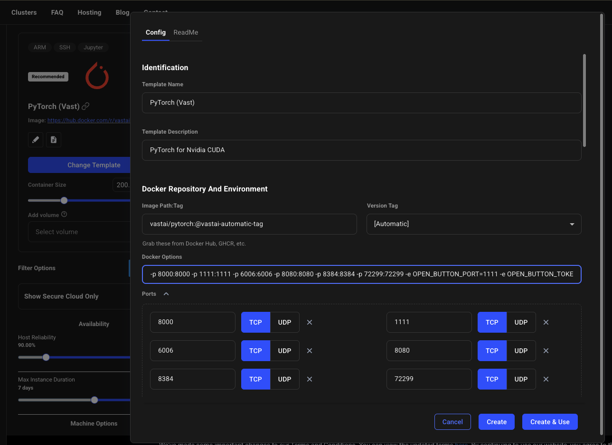
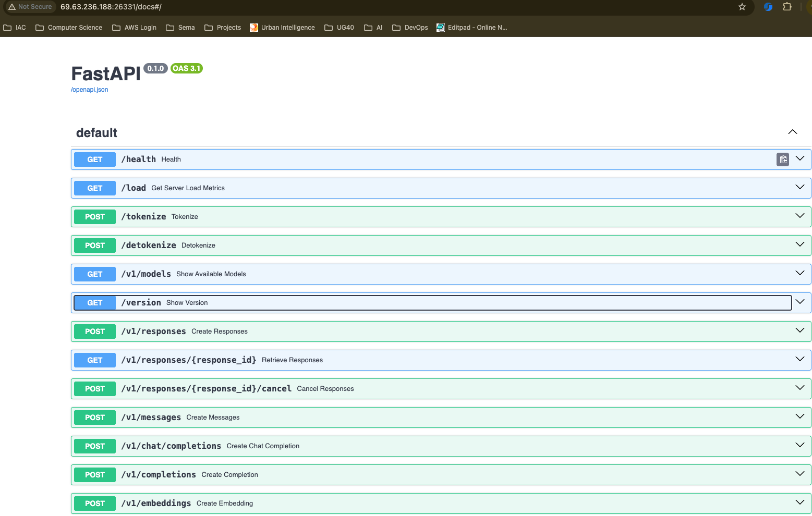
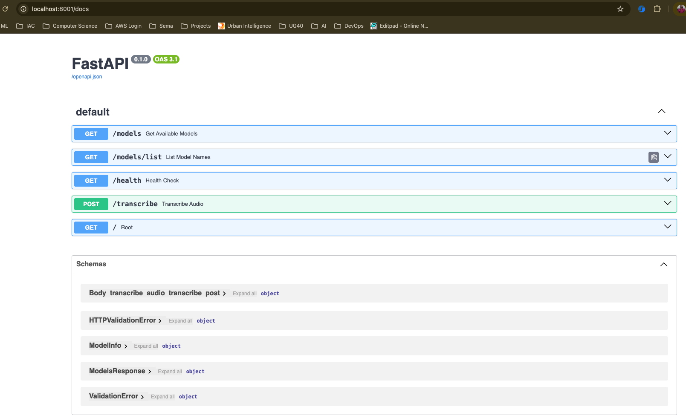

# Sunflower Ultravox vLLM streaming API Local Vast Set Up

Tested on RTX PRO 6000 WS (96GB)

- Launch one of the `RTX PRO 6000 WS (96GB)` on Vastai with `100GB+` container storage
- For the PyTorch(Vast) template, click edit and under `Docker Options` and this port mapping `-p 8000:8000` and click on `Create and Use` button. Also make sure to increase the container size to `100GB+` for effective model storage and caching.




Once the instance has started successfully, launch and in a terminal, start up vLLM as follows:

```
uv pip install vllm[audio] runpod natsort
```

Login with your `HF Token`

```sh
hf auth login
```

Start the vLLM server with the command below

```sh
# python -m vllm.entrypoints.openai.api_server --model jq/sunflower-ultravox-251111 --port 8000 --trust-remote-code

python -m vllm.entrypoints.openai.api_server --model huwenjie333/sunflower32b-ultravox-251114-3 --port 8000 --trust-remote-code
```

Go to the instances page and click on the `IP Address` of your instance `69.63.236` and under ports local for the one mapping to `8000/tcp` i.e `69.63.236.188:26331`


Once the server starts successfully on vast, you can see the exposed FastAPI docs. Browse to `http://69.63.236.188:26331/docs`




## Running our FastAPI app locally to call inference server on Vastai

Git clone the `worker-vllm` repository and checkout to the `runpod-deploy` branch

```sh
git clone https://github.com/SunbirdAI/worker-vllm.git
git checkout -b runpod-deploy
```

Change directory to `sunflower-ultravox-vllm`

```sh
cd sunflower-ultravox-vllm
```

Set a `VLLM_BASE_URL` in the `.env` file as an environment variable. Also add a `MODEL_NAME` that was used when launching the vLLM server

```
VLLM_BASE_URL="http://69.63.236.188:26331"
MODEL_NAME=huwenjie333/sunflower32b-ultravox-251114-3
```

Create a virtaul environmemt install the dependencies below

```sh
python -m venv env
source env/bin/activate
pip install -r requirements.tx
```

Run fastapi app

```sh
python app.py
```

We can browse to `http://localhost:8001/docs` to see out fastapi docs. We are interested in the `/transcribe` endpoint



On another terminal you can test the api by running

```sh
python test_app.py
```
